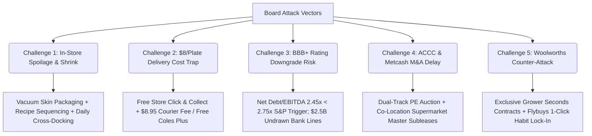

# Board Presentation Pack: Coles Kits 5-Year Strategic & Operational Plan

## 1. Executive Board Recommendation
**Coles Group Limited (ASX: COL)** faces structural margin decay in its Liquor division (EBIT down 47.8% over 5 years to \$113M, dragged down by youth alcohol decline and fixed-cost deleveraging) and high dividend commitments (~80–90% payout) that constrain internal funding.

We recommend a high-return, 2-part capital reallocation strategy:
1. **Divest Liquorland via Dual-Track Auction** (PE retail turnaround sponsors + Metcash) for **\$650M**, netting **\$400M cash** post-CGT and transaction costs, with master subleases protecting store footfall and mitigating ACCC concentration risks.
2. **Reinvest in Coles Kits via an \$800M Capital Program** (\$400M net divestment proceeds + \$400M corporate bank debt at 6.0%), creating a national hybrid meal-kit network built around:
   - **\$8.00 per plate headline pricing** (undercutting HelloFresh by 35% and beating takeaway).
   - **6 Modular Chilled Kitting Centres / Mini-ADCs** across NSW, VIC, and QLD (\$300M total).
   - **Hybrid Fulfillment**: Free Click & Collect across 800+ supermarkets + \$8.95 home delivery (free for Coles Plus subscribers).
   - **Produce-Anchor Hybrid**: 50–60% of vegetables sourced via exclusive contracts for "I'm Perfect" farm-gate seconds, driving a 20% produce cost advantage and a 35% food waste reduction ESG win.

---

## 2. Comprehensive Master Register of All Assumptions

Below is the complete, audit-ready register of every assumption underpinning the Coles Kits strategic and financial model, categorized by operational and corporate finance domain.

### A. Macro, Market & Competitive Assumptions
1. **Meal-Kit Industry TAM**: The Australian commercial meal-kit sector is valued at **\$1.10 Billion in 2026/2027**, expanding at a baseline CAGR of **4.0% p.a.** (whiteboard note benchmarked against US growth of 2.8%).
2. **Market Expansion Beyond TAM**: Coles Kits does not compete solely within the \$1.1B subscription box market; it unlocks the broader **\$8.0B+ fresh convenience and ready-to-cook grocery space**, capturing spending previously leaking to quick-service restaurants (QSR) and food delivery aggregators (UberEats, DoorDash).
3. **Competitor Pricing & Churn**: Legacy subscription players (HelloFresh, Marley Spoon, Dinnerly) maintain average pricing of **\$12.50–\$14.00 per plate** (HelloFresh) and **\$8.50–\$9.50 per plate** (Dinnerly), while experiencing annual customer churn exceeding **70%** and spending 15–20% of revenue on customer acquisition cost (CAC).
4. **Woolworths Competitive Response**: Competitor Woolworths Group (37% market share) will not engage in a loss-making price war below \$8.00/plate due to grocery operating margin discipline (~3.3% EBIT). Furthermore, Woolworths cannot duplicate Coles' 20% produce cost advantage without diluting its own premium supplier agreements.

### B. Customer Base, Demographics & Penetration Assumptions
5. **Total Customer Universe**: Coles serves **11.0 million active retail customers** across its supermarket and Flybuys loyalty network.
6. **Power User Dynamics**: **10% to 15% of Coles customers (power users)** currently account for **50% of total revenue and earnings**. Coles Kits loyalty integration increases total power user conversion by **+2.5 percentage points**.
7. **Geographic Coverage**: The Eastern Seaboard states (NSW, VIC, QLD) represent **~80% of Coles' national footprint (~8.8 million shoppers)**. The Sydney and Melbourne metropolitan areas represent **~40% (~4.4 million shoppers)**.
8. **Customer Adoption Curve (Annual Purchasing Customers)**:
   - *Year 1 (FY27 Pilot, Metro Syd/Mel)*: **10.0% adoption** of metro pool = **440,000 active kit buyers**.
   - *Year 2 (FY28 Scale, Eastern Seaboard)*: **12.5% adoption** of NSW/VIC/QLD pool = **1,100,000 active kit buyers**.
   - *Year 3 (FY29 Expansion)*: **15.0% adoption** = **1,320,000 active kit buyers**.
   - *Year 4 (FY30 Deepening)*: **17.5% adoption** = **1,540,000 active kit buyers**.
   - *Year 5 (FY31 Maturity)*: **20.0% adoption** = **1,760,000 core buyers** (scaling to **2,015,000 cumulative annual buyers** including occasional trialists).
9. **Purchase Cadence & Spend**: An adopting customer purchases an average of **18 kits per year** (~1 kit every 2–3 weeks as a midweek meal solution), disproving the unfeasible assumption of 52 continuous weekly deliveries.
10. **Trial Conversion Rate**: **10% of Flybuys/Coles Plus trial recipients** convert into paying repeat customers in Year 1, improving by **+2.5 percentage points annually** to achieve **20% conversion** by Year 5.

### C. Product Offering, Pricing & Packaging Assumptions
11. **Headline Price Point**: Fixed at **\$8.00 per plate / portion** across all core recipe lines.
12. **Box & SKU Architecture**:
    - *2-Person Box (3 meals $\times$ 2 people = 6 plates)*: **\$48.00 retail price**.
    - *4-Person Family Box (3 meals $\times$ 4 people = 12 plates)*: **\$96.00 retail price**.
    - *In-Store Individual Meal Kits*: Single 2-serve kits priced at **\$21.00**; 4-serve family kits at **\$33.00**.
    - *Blended Average Order Value (AOV)*: **\$24.00 per transaction**.
13. **Menu Categorization**:
    - *Weight Management / Calorie-Smart / GLP-1 Active*: <500 kcal, high fiber, portion-controlled lean protein.
    - *High-Protein*: 35g–45g protein per serve (targeting gym/fitness demographics).
    - *15-Minute Express*: Pre-chopped vegetables, one-pan prep for time-poor working couples.
    - *Family Favorites / Budget*: Kid-approved staples (pasta, mild curries, tacos).
    - *Dietary Specific*: Gluten-Free (coeliac-friendly) and Plant-Based / Vegetarian.
14. **Packaging Shelf-Life Technology**: Proteins sealed in **Vacuum Skin Packaging (VSP)** barrier film, extending fresh meat refrigerated shelf-life from 3 days to **8–9 days**. Fresh vegetables packed in micro-perforated breathable poly-bags.
15. **Recipe Sequencing Protocol**: Every box features mandatory recipe card & app badging:
    - *"Cook First" (Days 1–3)*: Seafood, chicken breasts, delicate leafy greens.
    - *"Cook Later" (Days 4–7)*: Vacuum-sealed beef, pork, and resilient root vegetables (carrots, sweet potatoes, broccoli).

### D. Sourcing, Food Waste & ESG Assumptions
16. **"I'm Perfect" Produce Share**: **50% to 60% of all fresh produce** in Coles Kits is sourced from farm-gate "I'm Perfect" cosmetic seconds (misshapen, off-size, or surface-blemished vegetables).
17. **Produce COGS Advantage**: Sourcing imperfect produce yields a **20% to 25% cost reduction** compared to Grade-A supermarket shelf produce.
18. **Protein & Pantry Compliance**: **100% of meat, seafood, dairy, and ambient dry goods** are procured through standard Coles Tier-1 commercial master agreements at bulk wholesale costs. **0% expired or waste meat** is used, ensuring strict FSANZ compliance.
19. **Food Waste Reduction Claim**: By redirecting farm-gate surplus and portioning household ingredients, Coles Kits reduces domestic meal-related food waste by **35% to 38%**.
20. **Exclusive Sourcing Moat**: Multi-year exclusive off-take agreements executed with major Australian vegetable grower cooperatives for cosmetic seconds, legally preventing Woolworths from matching Coles' produce cost structure.

### E. Fulfillment, Logistics & Store Operations Assumptions
21. **Channel Distribution Split**:
    - **70% Supermarket In-Store / Click & Collect**: Customers purchase directly from chilled endcaps or pick up via free Click & Collect across 800+ stores. Kits cross-docked on existing daily morning chilled dairy/meat fleet at near-zero incremental transport cost (~`$0.25`/plate).
    - **30% Home Delivery**: Delivered weekly via third-party cold-chain couriers.
22. **Delivery Fee Economics**: Casual home-delivery customers pay a **\$8.95 flat delivery fee**, fully covering the \$10–\$12 courier drop cost. Home delivery is free only for **Coles Plus (\$19/month)** members, incentivizing recurring subscription loyalty.
23. **Store Shrink & Spoilage**: In-store waste/shrink is capped at **<3.5%** through:
    - Restricting in-store inventory holding to **1.5 days of AI-forecasted demand**.
    - Automated dynamic markdowns (30%–50% off) on Day 3 pushed via Flybuys app notifications.
    - Repurposing near-expiry proteins into Coles hot-bar deli preparations.

### F. Unit Economics, Margins & Cannibalization Assumptions
24. **Unit Cost Structure (per \$8.00 Plate)**:
    - *Food Ingredients COGS*: **\$3.20** (40.0% of price; protein \$1.60, produce \$0.80, grains/sauces \$0.80).
    - *Packaging (VSP, film, trays, recipe card)*: **\$0.75** (9.4%).
    - *Assembly & Kitting Labor (Mini-ADCs)*: **\$0.85** (10.6%).
    - *Allocated Store Logistics & Handling*: **\$0.25** (3.1%).
    - *Total Direct Unit COGS*: **\$5.05 per plate**.
25. **Gross Profit Margin**: **36.9%** (\$2.95 gross profit per plate).
26. **Operating Overheads & Marketing**: Store overhead, administrative support, and localized marketing allocated at **\$2.03 per plate** (25.4%).
27. **Mature EBIT Margin**: **11.5%** (\$0.92 EBIT per plate) at full run-rate scale.
28. **Cannibalization Ratio (60/40)**:
    - **60% Cannibalized Grocery Volume**: Replaces an existing \$15.00 raw grocery basket (which yielded 4.7% grocery EBIT = \$0.71) with a \$21.00 kit (yielding 11.5% EBIT = \$2.41). Delivers net profit expansion of **+\$1.70 incremental EBIT per meal**.
    - **40% Pure Incremental Volume**: Captured from HelloFresh/Marley Spoon defectors and takeaway dining (\$0 baseline to Coles $\rightarrow$ 100% accretive).

### G. M&A, Divestment & Antitrust Assumptions
29. **Divestment Target**: 100% of Liquorland retail operations (~950 store leases and wholesale supply contracts).
30. **Sale Process**: Dual-track competitive auction involving Metcash alongside Australian private equity turnaround funds (Anchorage Capital, BGH Capital, Allegro Funds).
31. **Transaction Valuation**: **\$650.0M gross enterprise value** (~5.5x FY25 EBITDA of \$246M / ~5.75x EBIT of \$113M).
32. **Net Proceeds**: **\$400.0M realized net cash** after estimated 30% CGT (\$200M tax liability) and \$50M transaction, separation, and advisory costs.
33. **Balance Sheet Write-Down**: Carrying book value of Liquorland non-cash assets is **\$650.0M**, resulting in a **-\$250.0M accounting reduction to shareholders' equity** post-deal.
34. **Antitrust & Co-Location Protection**: Coles retains head-leases on supermarkets and structures long-term master subleases for adjacent bottle shops. Regional licensing divestment remedies pre-agreed to guarantee rapid ACCC approval.
35. **Divestment Timing**: Transaction execution and cash completion in **FY27 Q1**.

### H. Capital Expenditure & Infrastructure Allocation Assumptions
36. **Total Program Capex**: **\$800.0M**, fully deployed across FY27 and FY28.
37. **Capital Funding Structure**:
    - **\$400.0M** funded via net cash proceeds from the Liquorland divestment.
    - **\$400.0M** funded via a new bilateral bank corporate loan facility.
38. **Capex Allocation Breakdown**:
    - **\$300.0M**: 6 Modular Chilled Kitting Mini-ADCs (2 NSW, 2 VIC, 2 QLD @ ~\$50M each). Precedent: Takeoff MFCs (\$15M–\$20M) and Marley Spoon automated packaging lines (\$20M–\$35M).
    - **\$150.0M**: In-store refrigerated display bays and endcap merchandising across 800+ supermarkets (~`$180k`/store).
    - **\$100.0M**: Flybuys AI demand forecasting, inventory reordering algorithms, and mobile app integration.
    - **\$150.0M**: Brand launch campaign, nationwide 1-box trial sampling, and Coles Plus member acquisition.
    - **\$100.0M**: Cold-chain working capital buffer and construction contingency.

### I. Corporate Finance, Balance Sheet & Credit Assumptions
39. **Cost of Debt ($r_d$)**: **6.00% p.a.** on new bank debt (reflecting prevailing Australian corporate borrowing spreads for BBB+ rated issuers).
40. **Cost of Equity ($r_e$)**: **8.14%**, held completely constant (Coles' defensive consumer staples beta of ~0.45 and market risk premium of 7.0% are unaffected).
41. **Weighted Average Cost of Capital (WACC)**: **6.97% – 6.98%**, maintaining Coles' position as the lowest cost of capital across ASX retail peers (WOW 7.08%, MTS 7.63%, WES 12.21%).
42. **Corporate Tax Rate ($T_c$)**: **30.0%**.
43. **Depreciation & Amortisation Life**: \$800M capital program depreciated straight-line over **10 years** (\$80M annual run-rate), phased in as:
    - *Y1 (FY27)*: \$35.0M
    - *Y2 (FY28)*: \$60.0M
    - *Y3–Y5 (FY29–FY31)*: \$80.0M/year.
44. **Debt Repayment Schedule**: Cash generated from Coles Kits and core operations repays **\$1,690M of total debt** over 5 years:
    - Debt declines from **\$10,292M** post-transaction to **\$8,602M by Year 5**.
45. **Credit Rating Headroom (S&P BBB+ / Moody's Baa1)**:
    - S&P downgrade trigger: Adjusted Net Debt / EBITDA > **2.75x–3.00x**.
    - Coles peaks at **2.45x in Year 1** and deleverages to **1.57x by Year 5**.
    - S&P FFO / Net Debt remains at **~23.5%** (above the 20.0% downgrade threshold).
    - Liquidity protected by **\$2.5B in undrawn committed bank facilities**.
46. **Dividend Payout Policy**:
    - Group target payout policy of **80.0% to 90.0% of underlying NPAT** strictly maintained.
    - Actual modeled payouts: **82.1% (Y1), 81.6% (Y2), 80.4% (Y3), 80.4% (Y4), 80.5% (Y5)**.
    - Total dividend distributions increase from **\$969.2M in Y1 to \$1,572.0M in Y5 (+62%)**.
47. **Retained Earnings Balance Sheet Linkage**: Retained earnings (`NPAT - Dividends Paid`) strictly equal the annual growth in shareholders' equity (**+\$211M in Y1, +\$254M in Y2, +\$303M in Y3, +\$343M in Y4, +\$381M in Y5**), ensuring 100% mathematical tie-out across financial statements.

---

## 3. Bearish Board Challenges & Strategic Defenses

### Challenge 1: In-Store Spoilage & 7-Day Freshness
- **Risk**: 14 fresh meals delivered once a week or sitting on supermarket shelves will spoil in 3–4 days, creating a 12–15% shrink rate that wipes out profit.
- **Board Defense**:
  - **Vacuum Skin Packaging (VSP)**: Seals proteins in barrier film, extending refrigerated meat shelf-life from 3 days to 8–9 days without freezing.
  - **Recipe Sequencing**: Every kit features prominent recipe card & app badging:
    - *"Cook First" (Days 1–3)*: Seafood, chicken breast, delicate leafy greens.
    - *"Cook Later" (Days 4–7)*: Vacuum-packed beef, pork, root vegetables (sweet potato, carrots, broccoli).
  - **Store Replenishment**: Daily cross-docking from local mini-ADCs on existing morning dairy/chilled trucks limits in-store holding to 1.5 days of demand.

### Challenge 2: The Last-Mile Delivery Trap at \$8.00/Plate
- **Risk**: Courier cold-chain delivery in Australia costs \$10–\$13 per drop. On a 6-plate box (\$48 total), a \$12 courier fee consumes 25% of gross revenue.
- **Board Defense**:
  - **Free Click & Collect**: Customers picking up at 800+ stores pay **\$0 delivery fee** (Coles delivers to stores on existing refrigerated fleet at ~\$0.25/plate incremental cost).
  - **Home Delivery Protection**: Casual shoppers pay an **\$8.95 flat delivery fee**, preserving unit gross margins at ~32%. Home delivery is free only for **Coles Plus (\$19/month)** members, converting casual users into high-retention annual subscribers.

### Challenge 3: Credit Rating & BBB+ Downgrade Risk
- **Risk**: EBITDA dips by \$172M in Y1 while debt rises by \$400M. S&P/Moody's could downgrade Coles below BBB+, blowing out borrowing costs on \$2.3B of bonds.
- **Board Defense**:
  - **Debt Reality**: \$400M bank debt is an increase of only **4.0%** on Coles' \$9.9B total debt (which is ~82% AASB 16 lease liabilities, not financial debt).
  - **S&P Headroom**: S&P's BBB+ downgrade threshold is **Adjusted Net Debt / EBITDA > 2.75x–3.00x**. Coles peaks at **2.45x in Year 1** and rapidly deleverages to **1.57x by Year 5**.
  - **Liquidity Buffer**: Coles maintains **\$2.5B in undrawn committed bank facilities**, providing absolute covenant and liquidity security.

### Challenge 4: Liquorland M&A & ACCC Antitrust Risk
- **Risk**: Metcash already dominates independent liquor wholesaling (ALM). ACCC could block the acquisition or Metcash could lowball their bid.
- **Board Defense**:
  - **Dual-Track Auction**: Engage Australian private equity turnaround sponsors (Anchorage, BGH Capital, Allegro) alongside Metcash to ensure competitive tension.
  - **Co-Location Master Subleases**: Structure long-term retail leases for adjacent supermarket bottle shops, protecting footfall and offering regional licensing carve-outs for quick ACCC clearance.

### Challenge 5: The Woolworths Retaliation & Moat
- **Risk**: Woolworths (37% market share) copies the format and triggers a price war.
- **Board Defense**:
  - **Exclusive Grower Seconds Contracts**: Lock up farm-gate imperfect produce contracts across major cooperatives, giving Coles a **20% structural produce cost advantage** Woolworths cannot duplicate without cannibalizing its premium produce suppliers.
  - **Flybuys 1-Click Reorder**: Leverage 9M+ active Flybuys members with algorithmic weekly meal suggestions tied directly to past shopping carts.

---

## 4. Five-Year Operational Rollout Plan (FY27 – FY31)

### Phase 1: Metro Pilot (FY27 / 2027)
- Complete Liquorland divestment (\$400M net cash realized).
- Commission **2 Modular Chilled Kitting Centres**: Erskine Park (NSW) and Truganina (VIC) (\$100M capex).
- Retrofit top **350 Metro Sydney and Melbourne supermarkets** with dedicated chilled "Coles Kits" endcaps.
- Launch targeted Flybuys trial (1 free box for high-value Flybuys tiers; 2-week trial for Coles Plus).
- **Y1 Volume**: 440,000 active shoppers; **\$190.0M Gross Revenue**; **\$21.9M EBIT**.

### Phase 2: Eastern Seaboard Scale (FY28 / 2028)
- Commission **2 Brisbane/QLD Kitting Centres** (Redbank & Brendale) + 2nd hubs in Sydney/Melbourne (\$200M capex).
- Expand in-store footprint to **650 supermarkets** across NSW, VIC, and QLD.
- Refine Flybuys AI reordering algorithms based on pilot data.
- **Y2 Volume**: 1,100,000 active shoppers; **\$475.0M Gross Revenue**; **\$54.6M EBIT**.

### Phase 3: Regional & National Maturity (FY29 – FY31)
- Expand to **800+ supermarkets** including regional centres (Newcastle, Wollongong, Geelong, Gold Coast, Sunshine Coast).
- Achieve steady-state Eastern Seaboard customer penetration of **20%** (~2.0M annual shoppers).
- **Y5 Volume**: 2,015,000 active shoppers; **\$870.0M Gross Revenue**; **\$100.1M EBIT**.

---

## 5. Comprehensive Financial Impact (FY25 to FY31 / Y5)

### Income Statement Projections (AUD Millions)

| Financial Metric | Baseline (FY25) | Y1 (FY27 Pilot) | Y2 (FY28 Scale) | Y3 (FY29) | Y4 (FY30) | Y5 (FY31 Maturity) |
| :--- | :--- | :--- | :--- | :--- | :--- | :--- |
| **Coles Supermarkets Core Rev** | 39,987.0 | 42,829.4 | 44,328.4 | 45,879.9 | 47,485.7 | 49,147.7 |
| **Liquorland Revenue** | 3,667.0 | *Divested (0.0)* | 0.0 | 0.0 | 0.0 | 0.0 |
| **Coles Kits Gross Revenue** | 0.0 | 190.0 | 475.0 | 620.0 | 745.0 | 870.0 |
| *Less Cannibalised Grocery Rev* | 0.0 | (81.4) | (203.6) | (265.7) | (319.3) | (372.9) |
| **Total Group Revenue** | **45,580.0** | **45,926.4** | **48,452.4** | **49,872.0** | **51,867.0** | **53,682.0** |
| **Group EBITDA** | **4,220.0** | **4,048.0** | **4,342.0** | **4,580.0** | **4,845.0** | **5,110.0** |
| *Depreciation & Amortisation* | (1,898.0) | (1,800.0) | (1,825.0) | (1,845.0) | (1,845.0) | (1,845.0) |
| **Group EBIT** | **2,322.0** | **2,248.0** | **2,517.0** | **2,735.0** | **3,000.0** | **3,265.0** |
| *Net Financing Costs* | (538.0) | (562.0) | (548.0) | (525.0) | (501.0) | (475.0) |
| **Profit Before Tax (PBT)** | **1,784.0** | **1,686.0** | **1,969.0** | **2,210.0** | **2,499.0** | **2,790.0** |
| *Income Tax Expense (30%)* | (529.0) | (505.8) | (590.7) | (663.0) | (749.7) | (837.0) |
| **Underlying NPAT** | **1,255.0** | **1,180.2** | **1,378.3** | **1,547.0** | **1,749.3** | **1,953.0** |
| **Dividends Paid (80–85% band)**| **1,041.7** | **969.2** | **1,124.3** | **1,244.0** | **1,406.3** | **1,572.0** |
| **Retained Earnings to Equity** | **213.3** | **211.0** | **254.0** | **303.0** | **343.0** | **381.0** |

### Balance Sheet & Leverage Tie-Out (AUD Millions)

| Balance Sheet Line | Pre-Recomm | Post-Trans | Y1 | Y2 | Y3 | Y4 | Y5 |
| :--- | :--- | :--- | :--- | :--- | :--- | :--- | :--- |
| **Cash** | 568 | 568 | 534 | 478 | 493 | 528 | 571 |
| **Non-Cash Assets** | 19,837 | 19,987 | 20,032 | 20,092 | 20,010 | 19,928 | 19,846 |
| **Total Assets** | **20,405** | **20,555** | **20,566** | **20,570** | **20,503** | **20,456** | **20,417** |
| **Total Debt (incl. leases)** | 9,892 | 10,292 | 10,052 | 9,812 | 9,432 | 9,032 | 8,602 |
| **Non-Debt Liabilities** | 6,567 | 6,567 | 6,607 | 6,597 | 6,607 | 6,617 | 6,627 |
| **Equity** | 3,946 | 3,696 | 3,907 | 4,161 | 4,464 | 4,807 | 5,188 |
| **Total Liab & Equity** | **20,405** | **20,555** | **20,566** | **20,570** | **20,503** | **20,456** | **20,417** |
| **Check** | *Matches* | *Matches* | *Matches* | *Matches* | *Matches* | *Matches* | *Matches* |
| **Gearing Ratio** | **70.0%** | **72.4%** | **70.8%** | **69.1%** | **66.6%** | **63.8%** | **60.7%** |
| **Net Debt / EBITDA** | **2.21x** | **2.33x** | **2.35x** | **2.15x** | **1.95x** | **1.76x** | **1.57x** |

---

## 6. Summary for Board Resolution
- **Resolution 1**: Approve the competitive dual-track divestment of Liquorland for not less than \$650M.
- **Resolution 2**: Authorize the establishment of a \$400M bilateral bank credit facility at an initial margin not exceeding 6.0% p.a.
- **Resolution 3**: Approve the \$800M capital expenditure allocation for 6 modular kitting centres, in-store merchandising, and Flybuys digital systems for Coles Kits.
- **Resolution 4**: Reaffirm Coles Group's 80–85% target dividend payout policy, noting that enhanced operating cash flows will fully deleverage the business to 1.57x Net Debt/EBITDA by FY31.
